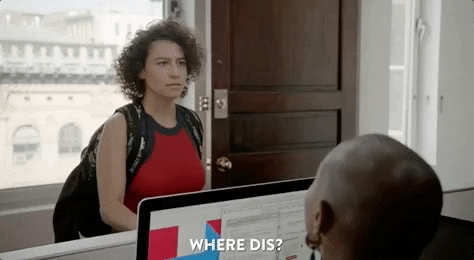
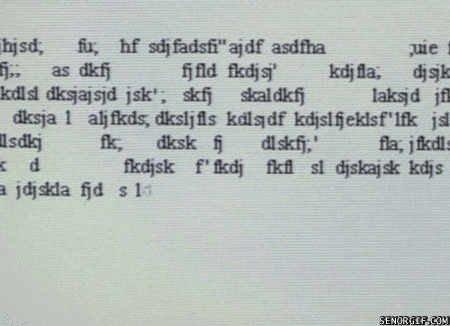

```{r setup, include = FALSE}
knitr::opts_chunk$set(warning = FALSE, message = FALSE, echo = FALSE, 
                      dpi = 300, cache = TRUE, fig.align = "center", 
                      out.width = "80%", fig.path = "figures/")

library(tidyverse)
library(broom)
library(knitr)
library(here)
library(tidytext)
library(gutenbergr)
library(dplyr)
library(MASS)
library(readr)
library(ggplot2)
select <- dplyr::select
```

class: middle

### About me

Graduated from Lewis & Clark College in 2017

* Majored in Math

Computer Science & Engineering PhD student at OHSU
* September 2017 - now

* Halfway through my 2nd year!

--


.pull-left[
Academic Interests

+ Computational Linguistics

+ Natural Language Processing

+ Speech and Language Disorders
]
.pull-right[
<br>
+ Discrete Math, Statistics

+ Data Science, Data Visualization

+ R, Python
]
---
class: middle

### About me

Graduated from Lewis & Clark College in 2017

* Majored in Math

Computer Science & Engineering PhD student at OHSU
* September 2017 - now

* Halfway through my 2nd year!


.pull-left[
Academic Interests

+ .look[Computational Linguistics?]

+ .look[Natural Language Processing?]

+ Speech and Language Disorders
]
.pull-right[
<br>
+ Discrete Math, Statistics

+ .look[Data Science?], Data Visualization

+ R, Python
]

---
class: middle

.fancy[Natural Language Processing (NLP)]

* .emphasize[Natural Language]

> "Any human language that has evolved naturally in a community, usually in contrast to computer programming languages or to artificially constructed languages such as Esperanto." <br> .sidebar[Wiktionary]

--

* .emphasize[Natural Language Processing]

> "...a subfield of computer science, information engineering, and artificial intelligence concerned with the interactions between computers and human (natural) languages, in particular .emphasize[how to program computers to process and analyze large amounts of natural language data]." <br> .sidebar[Wikipedia]

---
class: middle

.fancy[Computational Linguistics]

> "...the scientific study of language from a computational perspective. Computational linguists are interested in .emphasize[providing computational models of various kinds of linguistic phenomena]. These models may be "knowledge-based" ("hand-crafted") or "data-driven" ("statistical" or "empirical")." <br> .sidebar[Association for Computational Linguistics]

---
class: middle

.fancy[Computational Linguistics]

> "...the scientific study of language from a computational perspective. Computational linguists are interested in providing computational models of various kinds of linguistic phenomena. These models may be .emphasize["knowledge-based"] ("hand-crafted") or .emphasize["data-driven"] ("statistical" or "empirical")." <br> .sidebar[Association for Computational Linguistics]


---
class: middle

.fancy[Data Science]*


> "..a multi-disciplinary field that uses scientific methods, processes, algorithms and systems to extract knowledge and insights from structured and unstructured data." <br> .sidebar[Wikipedia]

.footnote[.smaller[One out of __many__ definitions]]

---
class: middle, center, inverse

## How did I get here?




---

__2009 - 2013__

* High school in Oakland, CA

* Know I like math & language...can I combine them?

--

* At the end of my Senior year, I found out about .fancy[computational linguistics] (thanks wikipedia!)

--

__2013 - 2014__
  + New York University
  
  + Took my first linguistics class

--

__2014 - 2015 __

  + Transferred to Lewis & Clark College
  
  + Started as a computer science major...

---

__2014 - 2015 __
  + ...took Calculus II, and then switched to math
  
--
  
  + Translation Theory & Practice
  
  + Calculus III, Linear Algebra, Discrete Math
  
--

__2015 - 2016__
  
  + Independent study: "Introduction to Computational Linguistics"
  
  + Math Colloquium Talk: "Atypical Language in Autism: Can we measure it?"
  
  + Met Jan van Santen (director of CSLU & my future advisor)
  
  + Summer internship at CSLU

--

__2016 - 2017__
  
  + Number Theory, Prob/Stats I & II

  + CSLU Internship #2
  
  + Applied for the PhD program at CSLU

---
class: middle

### What I do

Center for Spoken Language Understanding, OHSU

  + Automatic speech recognition, image processing, augmentative and alternative communication devices, ...
  
  + Computer Science & Electrical Engineering Master's & PhD programs
  
--

Funded by NIH grant

  + _Automated Measurement of Language Outcomes for Neurodevelopmental Disorders, R01DC012033_
  
  + Autism Spectrum Disorder (ASD), Fragile X Syndrome (FXS), Down Syndrome (DS)

---
class: middle

### I'm also...

Finishing up coursework requirements, here's what I've taken so far:

.pull-left[
+ Analyzing Sequences

+ Probability & Statistical Inference for Scientists and Engineers

+ Data Science Programming

+ Introduction to Linguistics & Communication Disorders

+ Principles & Practices of Data Visualization
]

.pull-right[
+ Artificial Intelligence

+ Algorithms

+ Natural Language Processing

+ Research Ethics in Computer Science

+ Machine Learning
]

<br>
<br>
.sidebar[If you want to talk about undergrad vs. grad school ask me during the Q&A, or come to the GemSTEM panel today at 6:30 pm!]
---
class: center, middle, inverse

## Research

---
class: middle

### My Current Research

Characteristics of Autism Spectrum Disorder (ASD)
    
  + Restricted, repetitive interests
  
  + Difficulties with social communication

--

.fancy[Pedantic speech]

  + Overly formal, adult-like speech
  
  + Using conventional words and phrases in unusual and peculiar ways
  
  + Jill Dolata's example:
    
    + "I ate shrimp for lunch"
    
    + "I ate crustaceans for lunch"
  
---
class: middle

### How is this currently measured?

#### Autism Diagnostic Observation Schedule (ADOS)
  
  + Standard ASD assessment tool
  
  + Series of semi-structured, examiner led activities
  
  + Coding scheme for behaviors characteristic of ASD 

--
  
  + Pedantic speech:
  
  > Use of words or phrases tends to be more repetitive or .look[formal] than that of most individuals at the same level of expressive language, but not obviously odd...

--

#### Limitations

* Subjective, inconsistent across examiners 

* Based on observational reports from parents/teachers/clinicians

---
class: middle

### Alternatives?

* Could try to develop an automated method to quantify this
    * ...but capturing something so subtle will be difficult

* How can you teach a computer to differentiate "I ate shrimp from lunch" from "I ate crustaceans for lunch?"

* Lots of different ways to be pedantic
  + Vocabulary choice
  + Style of speaking
  + Tone

* Usually want to smooth outliers, but in this case the outliers are the points we are interested in

--

 .emphasize[Q: Can pedantic speech in children with ASD be measured and described by using natural language processing methods?]

---
class: inverse, center, middle

## Language $\rightarrow$ Computer



---
class: middle

### Language is complicated...

--

Excerpts from a corpus of "confusing or misleading headlines" <sup>1<sup>

```{r echo=FALSE}
library(rcorpora)
headlines <- corpora("words/crash_blossoms")$crash_blossoms

headlines[2]
headlines[13]
headlines[14]
headlines[19]
headlines[21]
headlines[24]
headlines[31]
```
.footnote[[1] corpus: https://github.com/dariusk/corpora]
--
<br>
"`r headlines[19]`"     
* the hospital is sued by doctors who are 7 feet tall?
* the hospital is sued by seven podiatrists?  
<br>
<br>
<br>


---
class: middle

.emphasize[How do we teach a computer to understand language?]
* Need to represent language in a form that we can analyze computationally/mathematically/statistically

* Simplify language and represent it numerically

--

.emphasize[First step:] break apart the language into discrete units

  + Written text is made up of .emphasize[sentences]

  + Speech is made up of .emphasize[utterances]

--

.emphasize[We can break apart sentences and utterances even further into...]

---
class: middle

.fancy[Tokens]

* "A token is .emphasize[a meaningful unit of text], such as a word, that we are interested in using for analysis" - Text Mining with R

* "A rose is a rose" $\rightarrow$ [a, rose, is, a, rose]

--

* "aren't" $\rightarrow$ [are, n't], [are, not], [are, nt], or [aren't] ?

--

.fancy[Types]

 * "A rose is a rose" $\rightarrow$ [a, rose, is]

---
class: middle

.fancy[n-grams]  

* .emphasize[unigrams]: "A rose is a rose" $\rightarrow$ [a, rose, is, a, rose]

--

* .emphasize[bigrams]: "A rose is a rose" $\rightarrow$ [(a, rose), (rose is), (is, a), (a, rose)]

--

* .emphasize[trigrams]: "A rose is a rose" $\rightarrow$ [a, rose, is), (rose, is, a),...,(is, a, rose)]

--

.fancy[Morphemes]

* The smallest grammatical unit

* "unbreakable" $\rightarrow$ un - break - able

* "dogs" $\rightarrow$ dog - s

* "buyer" $\rightarrow$ buy - er
---
class: middle, inverse, center

## What can we use these for?

---
class: middle

### Q: How _much_ do they talk?

--

One way to measure this $\rightarrow$ .fancy[Mean Length of Utterance (MLU)]

* MLU = average number of morphemes per utterance for a sample of 100 utterances

* As a typically developing child gets older, they will produce longer and more complex utterances

* Used as a measure of expressive language, language productivity, and language development

  + _Expressive language_ is language used to communicate, while _receptive language_ is the ability to understand language
  
  + All else being equal, a higher MLU reflects a higher level of language proficiency


---

### MLU in Language Development


__Brown's Stages of Syntactic and Morphological Development__ <sup> 1,2 <sup>

|Stage|Age (months)|MLU|Example Utterances|
|:---|:---|:---|:---|
|I|12 - 26|1.0 - 2.0| "that car" <br> "more juice"|
|II|27 - 30|2.0 - 2.5| "it going" <br > "in box" <br> "my cars"|
|III|31 - 34|2.5 - 3.0| "man's book" <br> "was it Alison?"|
|IV|35 - 40|3.0 - 3.75| "the puppy chews it" <br> "a ball on the book" |
|V|47 + |4.5 + | "were you hungry?" <br> "we're hiding" |


.footnote[[1] Brown, R. (1973). _A First Language: The Early Stages._ London: George Allen & Unwin. <br>
[2] https://www.speech-language-therapy.com]
---

class: middle

### Q: How _repetitive_ are they being?

--

One way to measure this $\rightarrow$ .fancy[Type-Token Ratio (TTR)]

* Can talk a lot while not really saying much 

  + e.g. "row row row your boat..."

* $\text{ttr} = \frac{\text{# unique words}}{\text{total # words}}$

* Measures degree of lexical variation

  + A higher TTR reflects a more diverse vocabulary

  + If someone says a lot but is very repetitive they will have a lower TTR

---
```{r echo=FALSE}
# baa baa black sheep
sheep <- c("Baa, baa, black sheep,", "Have you any wool?", "Yes sir, yes sir,", 
           "Three bags full.", "One for the master,", "One for the dame,",
           "And one for the little boy", "Who lives down the lane.", 
           "Baa, baa, black sheep,", "Have you any wool?", "Yes sir, yes sir,",
           "Three bags full.", "One to mend the jerseys", "one to mend the socks",
           "and one to mend the holes in", "the little girls' frocks.",
           "Baa, baa, black sheep,", "Have you any wool?", "Yes sir, yes sir,",
           "Three bags full.")

sheep_df <- tibble(lines = sheep) %>% 
  unnest_tokens(word, lines) %>% 
  add_count(word, sort = TRUE) %>% 
  distinct(word, n, .keep_all = TRUE)

sheep_tokens <- sum(sheep_df$n)
sheep_types <- nrow(sheep_df)

# shakespeare sonnet 18
sonnets <- corpora("words/literature/shakespeare_sonnets")[[2]]
sonnet_18 <- sonnets$lines[18][[1]]

sonnnet_df <- tibble(lines = sonnet_18) %>% 
  unnest_tokens(word, lines) %>% 
  add_count(word, sort = TRUE) %>% 
  distinct(word, n, .keep_all = TRUE)

sonnet_tokens <- sum(sonnnet_df$n)
sonnet_types <- nrow(sonnnet_df)
```

.pull-left[
Baa Baa Black Sheep
.smaller[
Baa, baa, black sheep,  
Have you any wool?  
Yes sir, yes sir,  
Three bags full.  

One for the master,  
One for the dame,  
And one for the little boy  
Who lives down the lane.  

Baa, baa, black sheep,  
Have you any wool?  
Yes sir, yes sir,  
Three bags full.  

One to mend the jerseys  
one to mend the socks  
and one to mend the holes in  
the little girls' frocks.  

Baa, baa, black sheep,  
Have you any wool?  
Yes sir, yes sir,  
Three bags full.  
]
]

.pull-right[
Shakespeare's Sonnet XVIII
.smaller[
Shall I compare thee to a summer’s day?  
Thou art more lovely and more temperate:  
Rough winds do shake the darling buds of May,  
And summer’s lease hath all too short a date;  
Sometime too hot the eye of heaven shines,  
And often is his gold complexion dimm'd;  
And every fair from fair sometime declines,  
By chance or nature’s changing course untrimm'd;  
But thy eternal summer shall not fade,  
Nor lose possession of that fair thou ow’st;  
Nor shall death brag thou wander’st in his shade,  
When in eternal lines to time thou grow’st:  
&nbsp;&nbsp;So long as men can breathe or eyes can see,  
&nbsp;&nbsp;So long lives this, and this gives life to thee.  
]
]

--

|title|# types|# tokens|type-token-ratio|
|:---|:---|:---|:---|
|Baa Baa Black Sheep|`r sheep_types`|`r sheep_tokens`|`r sheep_types/sheep_tokens`|
|Sonnet XVII|`r sonnet_types`| `r sonnet_tokens`|`r sonnet_types/sonnet_tokens`|


---
class: middle

### Q: _What_ are they talking about?

--

One way to capture this $\rightarrow$ .fancy[Term-Document Matrix]

* A matrix of frequencies for term (i.e. type) in a collection of documents (i.e. samples, texts, etc.)  

  + Frequencies can be raw counts, transformed counts, weighted counts, etc.

* Useful for comparing documents to one another

* Can see which words appear frequently and which words appear infrequently

* .emphasize[Language] $\rightarrow$ .emphasize[matrix of numbers] $\rightarrow$ .emphasize[linear algebra!]

---
class: middle

```{r echo=FALSE}
shakespeare <- corpora("words/literature/shakespeare_phrases")[[2]]

shakespeare2 <- shakespeare[2]
shakespeare3 <- shakespeare[3]
shakespeare9 <- shakespeare[9]
shakespeare48 <- shakespeare[48]
```

.pull-left[
.emphasize[Phrases coined by Shakespeare:]

"`r shakespeare2`"  
"`r shakespeare3`"
]
.pull-right[
<br>
<br>
"`r shakespeare9`"  
"`r shakespeare48`"
]

--

.emphasize[Term-Document Matrix using raw counts:]
```{r echo = FALSE}
shakespeare_df <- tibble(`D1` = shakespeare2,
                         `D2` = shakespeare9, 
                         `D3` = shakespeare48,
                         `D4` = shakespeare3) %>% 
  gather(doc, term, D1, D2, D3, D4) %>% 
  group_by(doc) %>% 
  unnest_tokens(term, term) %>% 
  add_count(term) 

term_doc <- shakespeare_df %>% 
  distinct(term, .keep_all = TRUE) %>% 
  ungroup(doc) %>% 
  complete(doc, term, fill = list(n=0)) %>% 
  spread(term, n) %>% 
  column_to_rownames(var = "doc") %>% 
  as.matrix()


term_doc
```

--

.emphasize[Limitations]

* Term-Document Matrices are typically sparse and high-dimensional (we will circle back to this later)

* Counts for commonly used words like "and", "is", and "the" (a.k.a. _stop words_) will be inflated

  + Could remove these words before analysis,
  + ...or use a weighting scheme like .emphasize[tf-idf]


---
class: middle

.fancy[Term Frequency-Inverse Document Frequency (tf-idf)]

>"....tf-idf is intended to measure .emphasize[how important a word is to a document in a collection] (or corpus) of documents, for example, to one novel in a collection of novels or to one website in a collection of websites." <sup>1<sup>

--

* $\text{tf-idf} = \text{tf}(term, doc) \times \text{idf}(term)$
  
  + $\text{idf}(term) = ln(\frac{n_{\text{documents}}}{n_{\text{documents containing term}}})$

  + Term frequency = frequency of $t$ in $d$ 
  
  + Inverse document frequency = how "important" $t$ is across all documents
  
+ Identifies the words that are used a lot in a document but are not too common overall

  + Words that are frequently used across all documents will have a _lower_ tf-idf value while words that are rarely used overall will have a _higher_ tf-idf value


.footnote[[1] https://www.tidytextmining.com/tfidf.html]
---
class: middle

### Back to the Shakespeare example

.emphasize[Term-Document Matrix using raw counts]
```{r echo=FALSE}
term_doc
```

--

.emphasize[Term-Document Matrix using tf-idf]
```{r echo=FALSE}
total_shakespeare <- shakespeare_df %>% 
  group_by(doc) %>% 
  mutate(total = sum(n)) %>% 
  ungroup()

shakespeare_tf_idf <- total_shakespeare %>% 
  bind_tf_idf(term, doc, n)

# shakespeare_tf_idf %>% 
#   distinct(term, idf) %>% 
#   arrange(idf)
```

```{r echo=FALSE}
shakespeare_tf_idf %>% 
  select(doc, term, tf_idf) %>% 
  group_by(doc) %>% 
  distinct(term, .keep_all = TRUE) %>% 
  ungroup() %>% 
  complete(doc, term, fill = list(tf_idf=0)) %>% 
  spread(term, tf_idf) %>% 
  column_to_rownames(var = "doc") %>% 
  as.matrix() %>% 
  round(2) 
  #kable(format="html")

```

* $\text{tf-idf}(all, \text{D1}) = 1 \rightarrow 0.05$
* $\text{tf-idf}(glitters, \text{D1}) = 1 \rightarrow 0.23$


---


class: inverse, center, middle

## How can we use these tools <br> to measure pedantic speech?

---
class: middle
### Measuring pedantic speech


* Lots of different ways to be pedantic

  + Vocabulary choice
  + Style of speaking
  + Tone

---
class: middle
### Measuring pedantic speech

* Lots of different ways to be pedantic

  + .look[Vocabulary choice]
  + Style of speaking
  + Tone

.emphasize[Hypothesis: ] Using infrequent/uncommon words $\rightarrow$ pedantic speech

---
class: middle

```{r echo=FALSE, warning=FALSE, message=FALSE}
mind_raw <- read_csv("data/mind-conv-t1.csv",
                 col_types = cols(
                   participant_id = col_factor(),
                   dx = col_factor(levels = c("FXS", "DS", "ASD")),
                   site = col_factor(),
                   age = col_double(),
                   age_group = col_factor(levels = c("6 to 11", "6  to 11", "12 to 17", "18 and older"),
                     order = TRUE),
                   sample_date = col_date(),
                   activity = col_factor(),
                   speaker = col_factor(),
                   utterance = col_character()))

mind_proc <- mind_raw %>% 
  mutate(utterance = str_to_lower(utterance),
         
         # remove coded words, e.g. "xxx"
         utterance = str_replace_all(utterance, "x{1,3}", ""),
         
         # remove all punctuation but keep apostrophes
         utterance = str_replace_all(utterance, "[?!^,.//]", ""),
         
         # remove "3" from phonetic "3s" and one solo 3
         utterance = str_replace_all(utterance, "3", ""),
  )
```


### The data I have to work with

* Data collected by the .emphasize[UC Davis MIND Institute] (Medical Investigation of Neurodevelopmental Disorders)

* Transcribed conversations (n = 254) between an examiner and a child

  + ~ 10 minutes long
  
  + Diagnosis groups: ASD, FXS, and DS
  
  + Age range: 6-23 years

  + Examiner introduces a series of topics from a provided list
  
  + .emphasize[Goal:] child does most of the talking
  
  
```{r echo=FALSE}
mind_proc %>% 
  distinct(participant_id, dx, age_group) %>% 
  count(dx) %>% 
  kable(format="html")
```


---
class: middle

### First, text preprocessing

  + Convert all letters to lowercase
  
  + Remove all coded words - e.g. "xxx and I went to the park"
  
  + Remove all punctuation except apostrophes (keep contractions as is - e.g. "don't" vs. "do not")
   
  + Tokenize into unigrams  

---
class: middle, center

### After Preprocessing

.pull-left[
Top 5 child words
```{r echo=FALSE}
child_words <- mind_proc %>% 
  filter(speaker == "child") %>% 
  unnest_tokens(token, utterance, token="words") %>% 
  count(token, sort = TRUE) 

child_words %>% 
  head(n=5) %>% 
  kable(format="html")
```
]

.pull-right[
Top 5 examiner words
```{r echo=FALSE}
exam_words <- mind_proc %>% 
  filter(speaker == "exam") %>% 
  unnest_tokens(token, utterance, token="words") %>% 
  count(token, sort = TRUE)

exam_words %>% 
  head(n=5) %>% 
  kable(format="html")
```
]
<br>
<br>
<br>
<br>
Total # of child types = `r nrow(child_words)`  

Total # of examiner types = `r nrow(exam_words)`


---
class: middle


.emphasize[Hypothesis:] 

Using infrequent/uncommon words $\rightarrow$ pedantic speech

.emphasize[Approach:]

1. Create a document matrix where a document corresponds to a participant
  
2. Use a transformed frequency value: $\log(\frac{n_{word}}{n_{total words}} +1)$ 
  
3. Explore dimensionality reduction methods to reduce dimensions of term-document matrix down to 2 dimensions
  
4. Visualize results

--

.emphasize[Limitations:]

+ Might not capture 2+ word phrases that are pedantic
  
+ Exploratory - visualizations are just the first step
  

---
class: middle

### Examiner & Child Speech
```{r echo=FALSE,warning=FALSE,message=FALSE,results="hide"}
both_words <- mind_proc %>% 
  mutate(id = str_c(participant_id, speaker, sep = "_")) %>% # new id
  select(id, utterance) %>% 
  unnest_tokens(token, utterance, token="words") %>% 
  add_count(id, token) %>% 
  distinct(id, token, .keep_all = TRUE) %>% 
  group_by(id) %>% 
  mutate(total = sum(n)) %>% 
  ungroup() 


both_freq <- both_words %>% 
  mutate(freq = n/total,
         trns_freq = log10(freq + 1))

both_termdoc <- both_freq %>% 
  select(token, id, trns_freq) %>% 
  spread(key = id, value = trns_freq, fill = 0)

both_cor <- both_termdoc %>% 
  select(-token) %>% 
  cor()

both_nm_mds_2d <- isoMDS(d = 1-both_cor, k = 2)
#both_nm_mds_2d$stress

both_info <- mind_raw %>% 
  mutate(id = str_c(participant_id, speaker, sep = "_")) %>% 
  distinct(id, speaker, dx) %>% 
  mutate(new_dx = case_when(
    speaker == "exam" ~ NA_character_,
    speaker == "child" ~ as.character(dx)
  ))


both_coords <- both_nm_mds_2d$points %>% 
  as_tibble() %>% 
  rename(x = V1, y = V2) %>% 
  bind_cols(both_info)


ggplot(both_coords, aes(x, y, color = speaker)) +
  geom_point(alpha = 0.5) +
  theme_minimal() +
  labs(title = "MDS, MIND conversational language samples, T1",
       subtitle = "Child & Examiner")
```

---
class: middle
### Examiner and Child Speech
```{r echo=FALSE}
ggplot(both_coords, aes(x, y, color = new_dx)) +
  geom_point(alpha = 0.5) +
  theme_minimal() +
  labs(title = "MDS, MIND conversational language samples, T1",
       subtitle = "Child & Examiner")
```

---
class: middle

### Child Only

```{r echo=FALSE,warning=FALSE,message=FALSE,results="hide"}
child_words <- mind_proc %>% 
  filter(speaker == "child") %>% 
  select(-site, -sample_date, -speaker) %>% 
  unnest_tokens(token, utterance, token="words") %>% 
  add_count(participant_id, token) %>% 
  distinct(participant_id, token, .keep_all = TRUE) %>% 
  group_by(participant_id) %>% 
  mutate(total = sum(n)) %>% 
  ungroup() 

child_freq <- child_words %>% 
  mutate(freq = n/total,
         trns_freq = log10(freq + 1))

child_termdoc <- child_freq %>% 
  select(token, participant_id, trns_freq) %>% 
  spread(key = participant_id, value = trns_freq, fill = 0)

child_cor <- child_termdoc %>% 
  select(-token) %>% 
  cor()

nm_mds_2d <- isoMDS(d = 1-child_cor, k = 2)
nm_mds_2d$stress

child_info <- mind_raw %>% 
  filter(speaker == "child") %>% 
  distinct(participant_id, dx)


coords <- nm_mds_2d$points %>% 
  as_tibble() %>% 
  rename(x = V1, y = V2) %>% 
  bind_cols(child_info)


ggplot(coords, aes(x, y, color = dx)) +
  geom_point(alpha = 0.5) +
  theme_minimal() +
  labs(title = "MDS, MIND conversational language samples, T1",
       subtitle = "Child Only")


# ggplot(coords, aes(x, y, label = dx, color = dx)) +
#   geom_text(alpha = 0.5) +
#   theme_minimal() +
#   labs(title = "MDS, MIND conversational language samples, T1",
#        subtitle = "Child Only")
```


---

### To Do

* Plots using ERPA data
  - Double check that I don't have examiner speech 


